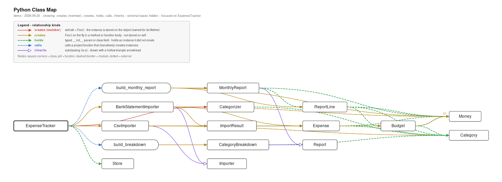
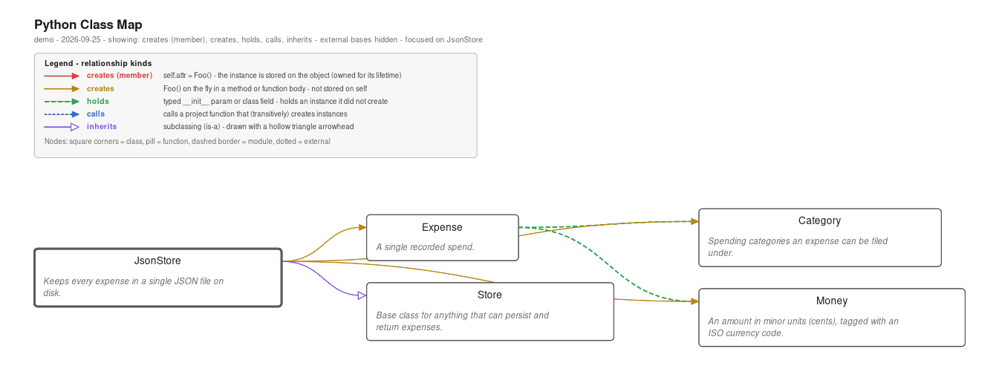

# Python Class Map

**See your Python project's real architecture: who creates whom.**

UML tools like pyreverse show *inheritance* — but in most modern Python
codebases the interesting structure isn't "is-a", it's **instantiation**:
which function builds which objects, which class owns which instance, which
dataclass holds which other one. Python Class Map statically analyzes your
whole workspace and shows exactly that, as a navigable sidebar tree and an
interactive diagram — with one-click vector export to PDF or SVG.



## Why not just a UML class diagram?

If most of your classes inherit from one base (`BaseModel`, `Enum`, a common
event class…), an inheritance diagram collapses into a useless star. And if
your orchestration lives in functions rather than classes — as it does in
most service, agent, and pipeline codebases — classic class diagrams show
nothing at all. Python Class Map treats **module-level functions as
first-class instantiation contexts**, so `main() → Engine → Wheel` chains
appear the way you actually think about them.

## Features

### 🌳 Instantiation tree

A sidebar view rooted at your project's true entry points — the contexts
nothing else creates or calls — sorted by how much of the codebase each one
transitively reaches. Expand any node to see what it creates, holds, or
calls; click to jump to the exact line of the instantiation. Re-analyzes
automatically whenever you save a Python file.

### 🔗 Five relationship kinds

| Kind | Style | Meaning |
|---|---|---|
| **creates (member)** | solid red | `self.attr = Foo()` — instance stored on the object (owned) |
| **creates** | solid amber | `Foo()` on the fly in a method/function body — not stored on `self` |
| **holds** | dashed green | typed `__init__` param or class field — holds an instance it didn't create (DI, dataclass/Pydantic fields, including through `list[Foo]`-style generics) |
| **calls** | dotted blue | calls a project function that (transitively) creates instances |
| **inherits** | solid purple, hollow arrow | subclassing — off by default so flat hierarchies don't flood the view |

Toggle any combination from the filter picker or the diagram toolbar.
**External base classes** (`BaseModel`, `TypedDict`, `Protocol`, …) are
hidden by default and can be shown with one checkbox — so you can enable
`inherits` and see *your* hierarchy without every model pointing at its
framework base.

### 🗺️ Interactive diagram

Layered graph rendering with pan (drag) and zoom (wheel). Click a node to
highlight its neighbors, double-click to open its source, right-click a tree
node → **Show Diagram from Here** to focus on one subtree. Edge labels show
multiplicity (`×4` = instantiated at four sites). Fully theme-aware —
readable in light and dark themes.

### 📖 Docstrings, inline

Nodes with a docstring show a `▸` chevron — expand them in place, or use
**show docs** to expand every documented node at once. The tree view shows
docstrings in hover tooltips.



### 📤 Export to PDF or SVG

One button exports the current view — same layout, same filters, same
expanded docstrings — as a crisp **vector** file. Pick the format in the
save dialog. Every export includes a **legend explaining all five
relationship kinds** (kinds you've filtered out are marked "hidden in this
view"), plus the project name, date, and active filters, so the file is
self-explanatory when you paste it into a wiki, design doc, or review.
Everything is generated in-process: **no Graphviz, no browser, no
dependencies**.

## Try it

The repo ships a small [demo project](demo/expense_tracker) — a working
expense tracker written to exercise all five relationship kinds. Open the
`demo/` folder in VS Code (or point `pyclassmap.root` at it) to see the
views above on real, runnable code:

```bash
python3 -m expense_tracker.cli      # from demo/, prints a monthly report
```

## Requirements

- Any **Python 3.8+** available as `python3` (or set `pyclassmap.pythonPath`).
  The analyzer uses only the standard library — nothing to `pip install`.

## Commands

| Command | |
|---|---|
| `PyClassMap: Refresh` | re-run the analysis now |
| `PyClassMap: Show Diagram` | open the interactive diagram |
| `PyClassMap: Filter Edge Kinds` | choose relationship kinds + externals |
| `PyClassMap: Export Diagram (PDF/SVG)` | export the current view |

## Settings

| Setting | Default | |
|---|---|---|
| `pyclassmap.pythonPath` | `python3` | interpreter used to run the analyzer |
| `pyclassmap.root` | workspace root | subfolder to analyze |
| `pyclassmap.exclude` | `[]` | extra directory names to skip |
| `pyclassmap.includeTests` | `false` | include `tests/`, `test_*.py` |

## How it works, and honest limits

A fast single-pass analysis of your workspace using Python's `ast` module
(a ~100k-line project analyzes in well under a second). It builds a
per-module import table (`import x as y`, relative imports, star imports,
string annotations, generics) and resolves call targets to workspace
classes. Helper noise stays out: `calls` edges are kept only when the callee
transitively instantiates something.

Being purely static, it cannot see dynamic creation — `getattr` factories,
config-driven registries, `cls()` polymorphism. Those edges simply won't
appear; everything that does appear is real.

## Release notes

See [CHANGELOG.md](CHANGELOG.md).

## License

[MIT](LICENSE.txt)
